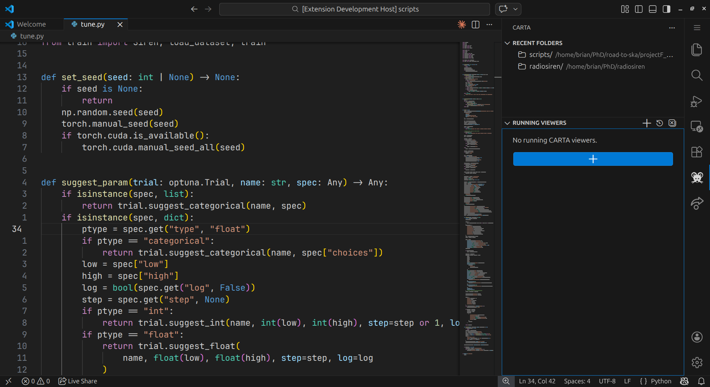
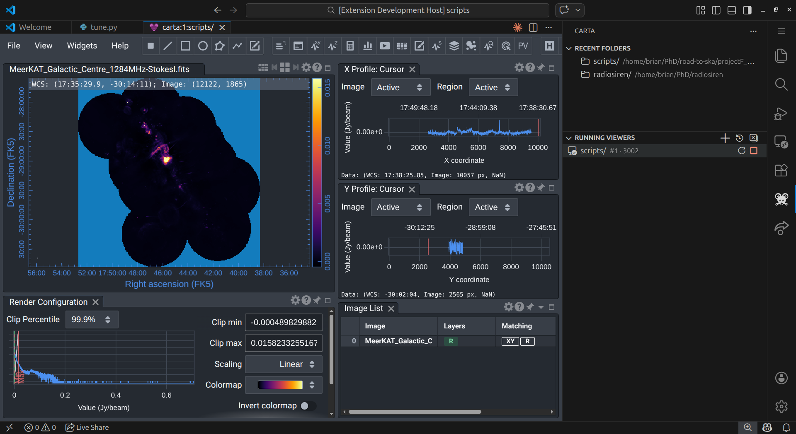
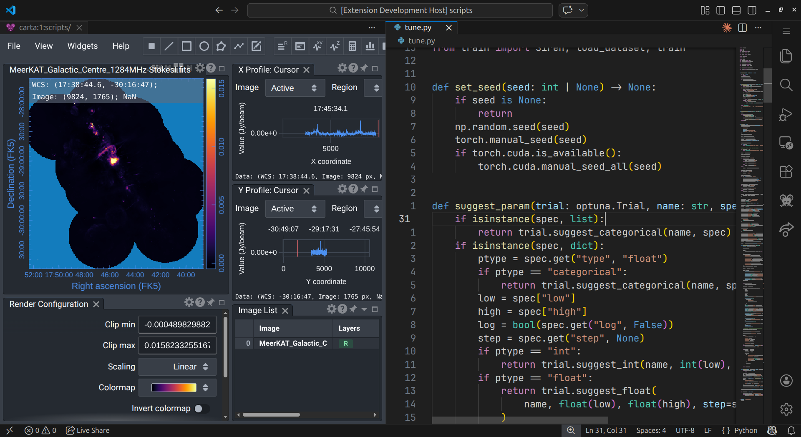
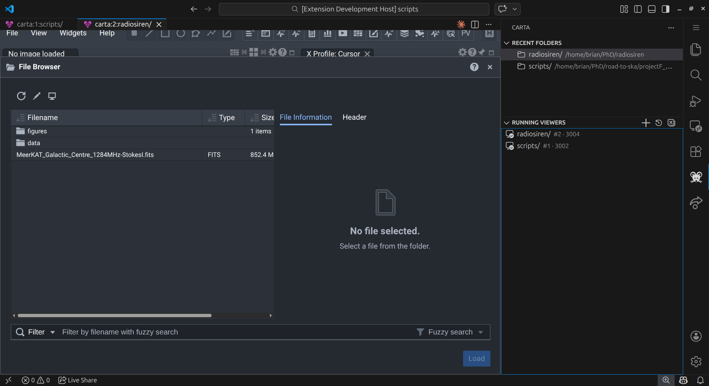

# Carta in VS Code

<p align="center">
  
</p>

[](https://github.com/kwazzi-jack/carta-in-vscode/actions/workflows/ci.yaml)
[](https://marketplace.visualstudio.com/items?itemName=kwazzi-jack.carta-in-vscode)

Run and view [CARTA](https://cartavis.org/) (Cube Analysis and Rendering Tool for Astronomy) as a seamless tab within VS Code. This extension manages the lifecycle of CARTA server processes, allowing you to visualiseyour astronomical data without leaving your favourite code editor.

## Preview

### CARTA Activity Bar



### CARTA in Full Screen



### CARTA in Split Screen



### CARTA with Two Viewers



## Features

- **Integrated Viewer:** Open CARTA as a VS Code Webview, Simple Browser, or in your external browser of choice.
- **Multiple Instances:** Run and manage multiple CARTA servers simultaneously on different ports.
- **Lifecycle Management:** Automatic port selection, process monitoring, and easy stopping/restarting of instances.
- **Sidebar Integration:** A dedicated Sidebar view to track running viewers and quickly reopen recent folders.
- **Output Logging:** View real-time logs from your CARTA servers in a dedicated VS Code Output Channel.
- **Path Sanitisation:** Robust validation of executable paths to ensure system security and stability.

## Requirements

- **CARTA:** Must be installed on your system. Get it at: [https://cartavis.org/](https://cartavis.org/)
- **Operating System:** Linux (Ubuntu/Debian recommended) or macOS.
- **Windows Users:** Direct execution on Windows is not supported. Please use [VS Code Remote - WSL](https://marketplace.visualstudio.com/items?itemName=ms-vscode-remote.remote-wsl) to run the extension within a Linux environment.

## Installation

### Visual Studio Marketplace
Search for `Carta in VS Code` in the VS Code Extensions view or visit the [Marketplace page](https://marketplace.visualstudio.com/items?itemName=kwazzi-jack.carta-in-vscode).

### Command Line
```bash
code --install-extension kwazzi-jack.carta-in-vscode
```

## Configuration

Customise the extension behaviour via VS Code Settings (`Ctrl+,`) or go to `File -> Preferences -> Settings`

### Settings

| Setting | Type | Default | Description |
| :--- | :--- | :--- | :--- |
| `executablePath` | `string` | `""` | Path to the CARTA binary. Can be a command in your `PATH` or an absolute path. Defaults to `carta` in `PATH`. |
| `executableArgs` | `string[]` | `[]` | Additional command-line arguments passed to the CARTA server. |
| `viewerMode` | `enum` | `"webview"` | Where to display CARTA: `webview`, `simpleBrowser`, or `externalBrowser`. |
| `portRange` | `string` | `"3002-3099"` | Range of ports to use for CARTA servers. |
| `maxConcurrentServers` | `number` | `5` | Maximum number of simultaneous CARTA instances. |
| `startupTimeout` | `number` | `-1` | Milliseconds to wait for startup before timing out (-1 for no timeout). |
| `browserExecutablePath` | `string` | `""` | Optional path to a specific browser binary for `externalBrowser` mode. Defaults to system browser.|
| `browserExecutableArgs` | `string[]` | `[]` | Additional arguments for the external browser. |

### Configuration Examples

**Performance Logging:**
To enable CARTA performance logs in the output channel:

```json
"carta-in-vscode.executableArgs": ["--log_performance"]
```

**Using a Specific Browser (macOS Example):**
```json
"carta-in-vscode.viewerMode": "externalBrowser",
"carta-in-vscode.browserExecutablePath": "/Applications/Google Chrome.app"
```

## Using a CARTA AppImage

If you are using the AppImage version of CARTA on Linux, follow these steps to initialise it:

1. **Make it Executable:**
   Open your terminal and run: `chmod +x /path/to/your/carta.AppImage`
2. **Set the Path:**
   In VS Code Settings, set `carta-in-vscode.executablePath` to the absolute path of your AppImage:
   `"/home/user/Downloads/CARTA-v4.0.AppImage"`
3. **FUSE Support:**
   Ensure your system has FUSE installed (standard on most modern Linux distributions) to allow the AppImage to mount and run.

## Command Palette Commands

Press `Ctrl+Shift+P` or go to `View -> Command Palette` to access these commands:

- `CARTA: Open Viewer`: Select a folder and start a new CARTA instance.
- `CARTA: Open Viewer (Workspace Folder)`: Quickly open the current workspace root.
- `CARTA: Open Recent Folder...`: Select from a history of recently opened folders.
- `CARTA: Stop Most Recent Viewer`: Kills the latest server process.
- `CARTA: Stop ALL Viewers`: Shuts down all running CARTA instances.
- `CARTA: Restart Viewer Instance`: (Sidebar only) Re-spawns a specific instance.

## Technical Notes & Risks

### Executable Validation
The extension performs rigorous sanitisation of all configured paths before execution:
- **Existence Check:** Verifies the file exists and is not a directory.
- **Permission Check:** Ensures the file has execution (`+x`) permissions.
- **Shell Protection:** Explicitly blocks common system shells (like `bash` or `zsh`) from being used as the CARTA binary to prevent accidental script execution loops.
- **macOS Bundle Support:** Automatically resolves `.app` bundles to their internal binaries.

### Potential Risks
- **Port Conflicts:** If your configured `portRange` overlaps with other services, CARTA may fail to bind. The extension will attempt to retry on up to 3 different ports before failing.
- **Resource Usage:** Running multiple CARTA instances can be intensive on system memory and CPU. Monitor your system resources if running many simultaneous viewers.

## Testing

This project includes a comprehensive test suite covering:
- Configuration parsing and validation.
- Port selection and availability checking.
- Process spawning and lifecycle management.
- Path sanitisation and security heuristics.

To run tests locally:
```bash
npm install
npm test
```

## Compatibility

- **VS Code:** `1.85.0` or higher.
- **Tested Platforms:** Ubuntu 22.04+, macOS Sonoma.
- **WSL:** Possible but untested.

## Author

- **Brian Welman** ([@kwazzi-jack](https://github.com/kwazzi-jack))

## Licence

This project is licensed under the MIT Licence - see the [LICENSE](LICENSE) file for details.

## Disclaimer

This is an unofficial extension. The official CARTA maintainers were not involved in its development. Please visit [cartavis.org](https://cartavis.org/) for official CARTA support.
