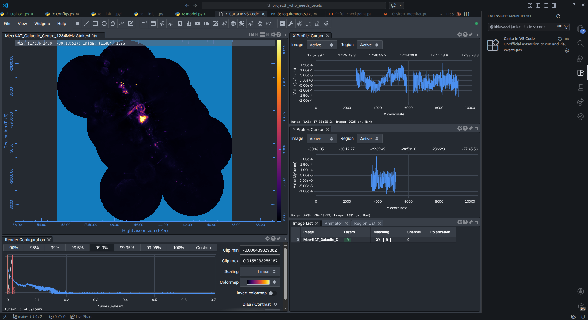
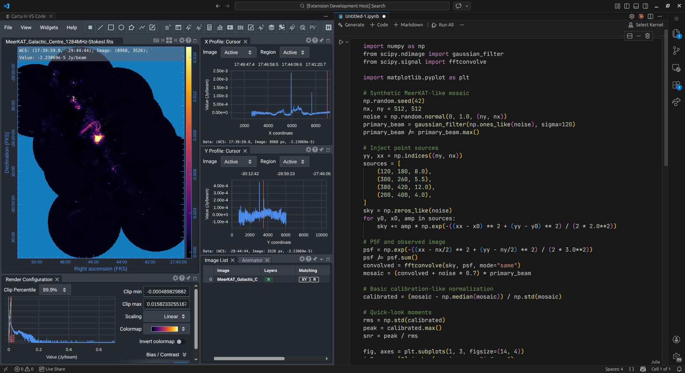

# Carta in VS Code

<p align="center">
  
</p>

[](https://github.com/kwazzi-jack/carta-in-vscode/actions/workflows/ci.yaml)
[](https://marketplace.visualstudio.com/items?itemName=kwazzi-jack.carta-in-vscode)

Run and view [CARTA](https://cartavis.org/) (Cube Analysis and Rendering Tool for Astronomy) as a tab inside VS Code.

## Preview

### CARTA in Full Screen



### CARTA in Split Screen



## Requirements

- CARTA must be installed on your system: https://cartavis.org/
- The `carta` executable must be visible from terminal, i.e. in `PATH` or path environment variables

## Installation

### Visual Studio Marketplace

1. Go to: [marketplace/kwazzi-jack.carta-in-vscode](https://marketplace.visualstudio.com/items?itemName=kwazzi-jack.carta-in-vscode)
2. Install directly via handler or follow instructions for manual install

### Visual Studio Code Extensions

1. Open **Visual Studio Code**
2. Open the Extensions view (`Ctrl+Shift+X` / `Cmd+Shift+X` on macOS)
3. Search for `Carta in VS Code`
4. Click **Install**

### Command Line

```bash
code --install-extension kwazzi-jack.carta-in-vscode
```

## Usage

1. Run command: `CARTA: Open Viewer`
2. To stop the server: `CARTA: Stop Server`

If you open VS Code on a folder, it will automatically provide that as the root for CARTA. Otherwise, a folder selector is provided.

## Compatibility

- VS Code `1.85.0` or higher
- Tested on VS Code `1.85.0`, `1.100.0`, stable, and insiders
- Supported platforms: Linux (Ubuntu), macOS
- **Windows Support**: Windows users are recommended to run the extension via [VS Code Remote - WSL](https://marketplace.visualstudio.com/items?itemName=ms-vscode-remote.remote-wsl) as CARTA is natively supported on Linux. Direct Windows execution is not officially supported at this time.

## Author

- **Brian Welman** ([@kwazzi-jack](https://github.com/kwazzi-jack))

## License

This project is licensed under the MIT License - see the [LICENSE](LICENSE) file for details.

## Disclaimer

This is an unofficial extension. The official CARTA maintainers were not involved in its development.
